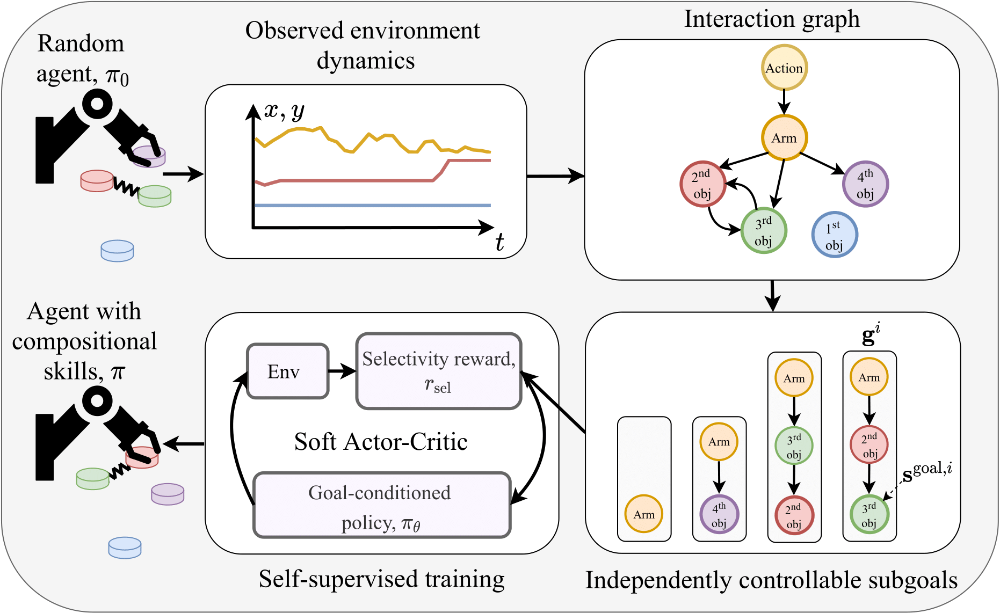

# Self-supervised Reinforcement Learning with Independently Controllable Subgoals (SRICS)

This repository contains the code release for the paper [Self-supervised Reinforcement Learning with Independently Controllable Subgoals](https://proceedings.mlr.press/v164/zadaianchuk22a.html) by Andrii Zadaianchuk, Georg Martius, Fanny Yang, published in CoRL 2021. Please use the [provided citation](#citation) when making use of our code or ideas.

The code is an adaptation of [RLkit](https://github.com/vitchyr/rlkit) for RL code and [multiworld](https://github.com/vitchyr/multiworld) for environments, both under MIT license.

## Abstract

To successfully tackle challenging manipulation tasks, autonomous agents must learn a diverse set of skills and how to combine them. Recently, self-supervised agents that set their own abstract goals by exploiting the discovered structure in the environment were shown to perform well on many different tasks. In particular, some of them were applied to learn basic manipulation skills in compositional multi-object environments. However, these methods learn skills without taking the dependencies between objects into account. Thus, the learned skills are difficult to combine in realistic environments. We propose a novel self-supervised agent that estimates relations between environment components and uses them to independently control different parts of the environment state. In addition, the estimated relations between objects can be used to decompose a complex goal into a compatible sequence of subgoals. We show that, by using this framework, an agent can efficiently and automatically learn manipulation tasks in multi-object environments with different relations between objects.

## SRICS Model



## Install

First, create and activate a new conda environment with 

```
conda env create -f srics_env.yml
conda activate srics
```

Next, install out modification of `rlkit` and `multiworld` packages. For this, change your dir to the cloned repo and run 

```
python -m pip install -e ./rlkit
python -m pip install -e ./multiworld
```

## Usage 


### SRICS training
All the hyperparameters files are stored in `./rlkit/settings` folder. 

To run SRICS training, just execute the corresponding `exp_name.py` file. For example, for SCIRS training on GT representations in 3 objects Rearrange environment run 


```
python  ./rlkit/settings/srics/rearrange_3_objects.py
``` 

### GNN training 
As initial stage, one should train sparse GNN model to discover relational graph. To train GNN model from scratch run

```
python  ./rlkit/settings/graph_learning/exp_name.py
```


### GNN weights aggregation 
After training of the sparse GNN, next step is to aggregate GNN weights to global graph of connections. 
For this, follow the instructions in `./rlkit/scripts/gnn_aggregation.py` adding your runs folders info and run
```
python  ./rlkit/scripts/gnn_aggregation.py
```

After GNN training, you can use the saved relational graph to predict global graph for this environment by additng "graph_path" to the `variant` dictionary, e.g.
```
variant["graph_path"]="path/to/graph"
```


### Visualization of the results 
The visualization of the results is similar to the original `rlkit` package. 
So please install `viskit` package from [here](https://github.com/vitchyr/viskit). 

After this, you can run a visualization of the results by 

```
python viskit/frontend.py ./data/exp_name/
```

## Citation

Please use the following bibtex entry to cite us:

```
@InProceedings{pmlr-v164-zadaianchuk22a,
  title = 	 {Self-supervised Reinforcement Learning with Independently Controllable Subgoals},
  author =       {Zadaianchuk, Andrii and Martius, Georg and Yang, Fanny},
  booktitle = 	 {Proceedings of the 5th Conference on Robot Learning},
  pages = 	 {384--394},
  year = 	 {2022},
  editor = 	 {Faust, Aleksandra and Hsu, David and Neumann, Gerhard},
  volume = 	 {164},
  series = 	 {Proceedings of Machine Learning Research},
  month = 	 {08--11 Nov},
  publisher =    {PMLR}
}
```

## Credits
We used code from [SMORL](https://github.com/martius-lab/SMORL) project that itself is based on 
[RLkit](https://github.com/vitchyr/rlkit) and [multiworld](https://github.com/vitchyr/multiworld) by Vitchyr Pong for RL infrastructure and SAC+HER training implementation.
